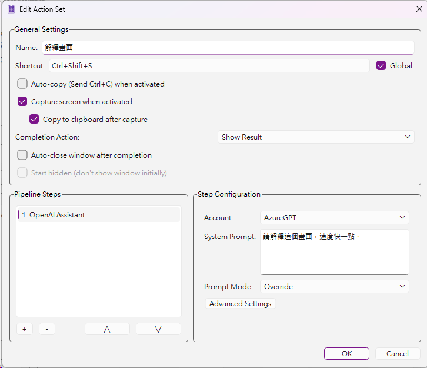
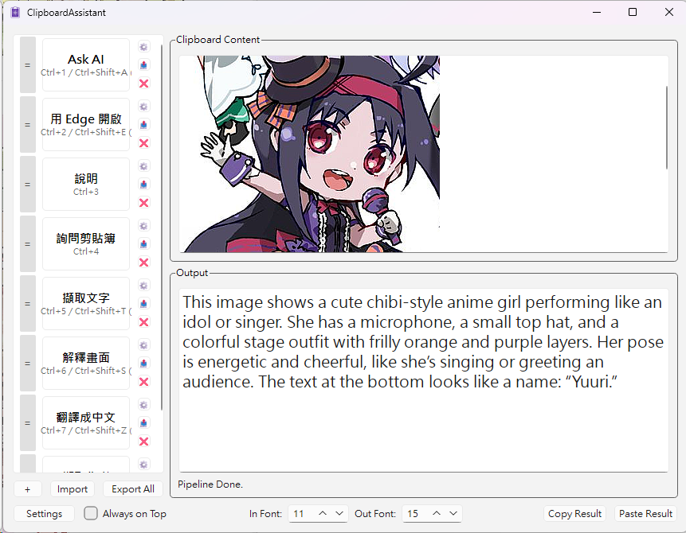
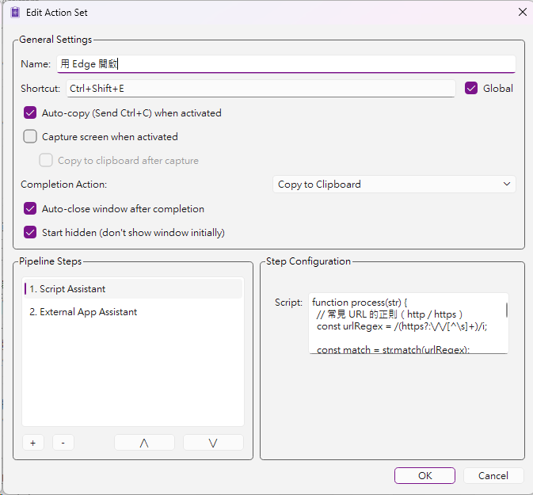

# Clipboard Assistant

[English](README.md) | [繁體中文](README_TW.md)

Clipboard Assistant is a Windows desktop tool built with Qt 6 for managing clipboard content and extending custom functionality through a plugin mechanism.

## Warnings

- This application was developed largely with assistance from Gemini and GPT.
- OpenAI / Gemini API keys are currently stored in plain text through `QSettings`; on Windows, this typically means they are stored in the Registry.

## Project Goals

- Stay in the system tray for quick access to the main window and settings window
- Run a sequence of custom actions through hotkeys, for example:
  - Automatically copy selected content and process it with AI using a predefined prompt, such as translation
  - Capture content on the screen and process it with AI using a predefined prompt, such as translation
  - Process clipboard content and then either paste the result directly or just update the clipboard for later use
- Load additional feature modules through the Qt plugin mechanism

## Usage Examples

### Configure a plugin

To use OpenAI features, you need to create a corresponding account first:

1. Click **Settings** in the lower-left corner of the main window to open the settings dialog.
2. In **Module Settings**, select **OpenAI Assistant** on the left, then click **Advanced Settings** on the right.
3. In **Manage OpenAI Accounts**, click **+** in the lower-left corner to add an account, then enter the name, API key, model, and base URL before clicking **OK**.
   - It is recommended to click **Test Connection** first to verify the settings.

### Create an action set

1. Click **+** in the lower-left corner to create a new action set.
2. Enter the action set name and configure a shortcut if needed.
   - You can enable **Global** to make it available from any application.
3. Adjust the startup and completion behaviors as needed.
4. Add the required functions from **Pipeline Actions** in the lower-left corner.
   - Multiple functions can be chained together.
   - Some functions provide additional options in **Step Configuration**.

### Example configuration

With a configuration like this, pressing Ctrl + Shift + S will let the user capture a region of the screen, send the captured image to the configured OpenAI service for inference, and display the result.

The result looks like this:

If needed, multiple functions can also be chained in one action set for more advanced processing:

## Included Features

### Built-in assistant modules

The main application includes several built-in assistant modules that can be added directly to an action set, for example:

- `RegEx Assistant`: matches, extracts, or replaces text using regular expressions
- `External App Assistant`: launches external programs
  - Can pass clipboard text into command-line arguments
  - Can capture the program output as the result
  - Can be chained with existing CLI tools or used to launch applications with specific arguments
- `Text Input Assistant`: inserts fixed text or prompts for manual input while the pipeline is running

These built-in assistants can be chained together with plugin modules to form multi-step action set workflows.

### Plugin-based assistant modules

Some more advanced features are currently implemented as plugins:

- `OpenAIAssistant`: a plugin integrated with the OpenAI API
  - Supports text, images, and streaming responses
  - In theory, supports all OpenAI API-compatible services
- `GemmiAssistant`: a plugin for Google AI services
  - Not thoroughly tested
- `ScriptAssistant`: a script-based plugin that uses JavaScript via `QJSEngine`
  - Each script must define a `process(text)` function
  - Standard JavaScript APIs such as `text.toUpperCase()` and `JSON.parse()` can be used

## Main Application Features

- Separate main window and settings window
- Settings window options include:
  - Global hotkey for opening the main window
  - Launch at startup
  - List of loaded plugins
- Main window can:
  - Display the current clipboard content
  - Display user-defined action sets
  - Create, edit, delete, and reorder action sets
  - Import or export one or more action sets as JSON
  - Assign hotkeys to individual functions
- Each action set can chain multiple steps into a processing pipeline
- Action sets support advanced options such as auto copy, screen capture, completion behavior, auto close, and start hidden
- When a plugin runs, it receives the current clipboard content or captured content and returns the processed result; the main application decides how to output it, such as updating the clipboard, showing the output, or pasting directly

## Build Environment

- Windows 11
- Visual Studio 2026
- Qt 6.11 (QtCore, QtGui, QtWidgets, QtNetwork, with some modules also using QML)

Open `ClipboardAssistant.slnx` to build the solution.

## Repository Structure

- `ClipboardAssistant/`: main application
- `OpenAIAssistant/`: OpenAI plugin
- `GemmiAssistant/`: Gemini plugin
- `ScriptAssistant/`: JavaScript plugin
- `Common/`: shared headers
- `doc/`: screenshots and document resources used by the README
- `licenses/`: third-party license files
- `ClipboardAssistant.slnx`: Visual Studio solution file
- `THIRD_PARTY_NOTICES.md`: third-party component notices

## Licensing and Third-Party Components

- Refer to the root `LICENSE.txt` for the project code license.
- When distributing binaries, include:
  - `THIRD_PARTY_NOTICES.md`
  - license files under the `licenses/` directory
- Qt licensing and source information:
  - https://www.qt.io/licensing/
  - https://code.qt.io/
- It is recommended to deploy Qt via dynamic linking to avoid restricting users' rights to replace LGPL components.
