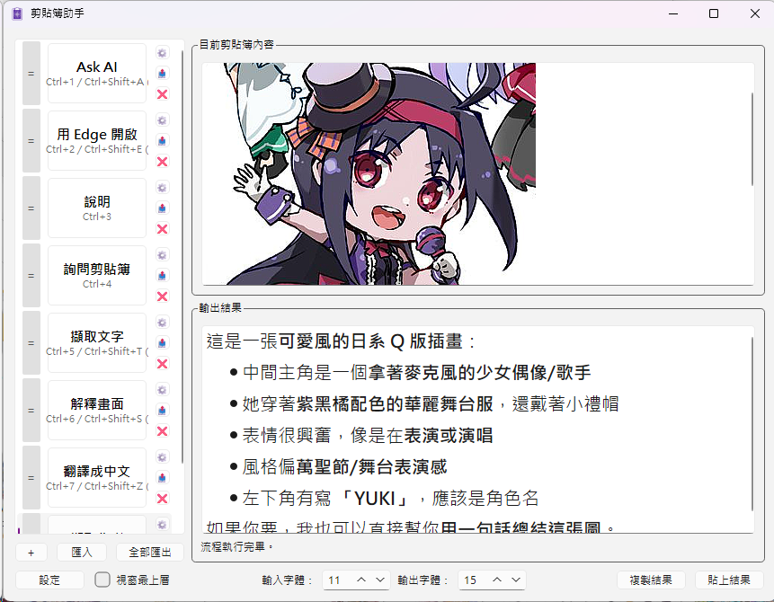
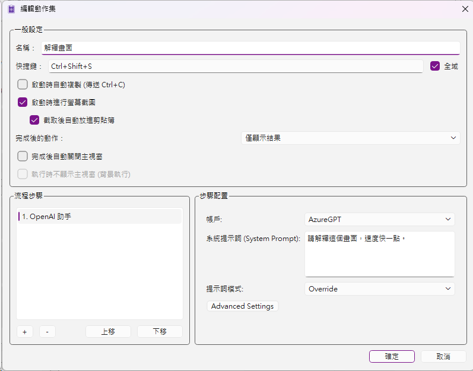
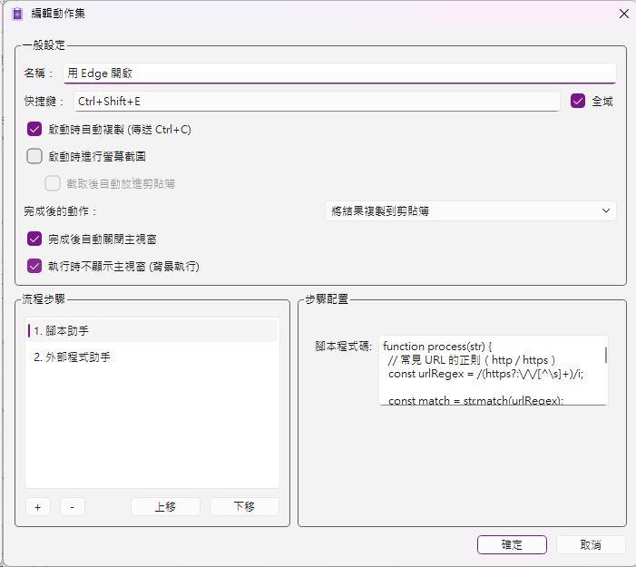

# Clipboard Assistant

[English](README.md) | [繁體中文](README_TW.md)

Clipboard Assistant 是一個以 Qt 6 製作的 Windows 桌面工具，用來協助管理剪貼簿內容，並透過外掛機制擴充自訂功能。

## 專案目標

- 常駐於系統匣，方便快速叫出主畫面與設定畫面
- 讓使用者檢視目前剪貼簿內容
- 透過快速鍵執行自訂動作
- 支援將處理結果直接貼上、更新剪貼簿或以視窗顯示
- 透過 Qt plugin 機制載入額外功能模組

## 目前包含的程式模組

- `OpenAIAssistant`：與 OpenAI API 整合的外掛模組，支援文字、圖片與串流回覆
- `GemmiAssistant`：額外外掛模組
- `ScriptAssistant`：以腳本方式擴充的外掛模組，使用 `QJSEngine` 執行 JavaScript

## 主程式功能

- 主介面與設定介面分離
- 設定介面可調整：
  - 叫出主介面的全域快速鍵
  - 開機自動執行
  - 已載入的 plugin 清單
- 主介面可：
  - 顯示目前剪貼簿內容
  - 顯示使用者自訂功能清單
  - 為各項功能設定快速鍵
- plugin 執行時會取得目前剪貼簿內容並回傳處理結果，由主程式決定後續輸出方式

## 截圖

### 主畫面

### Action Set 編輯器

### Action Set 編輯器 - 多動作

## 外掛設計

每個 plugin 可以提供一個或多個功能，並可定義：

- 功能名稱
- 功能說明
- 快速鍵
- 是否支援文字、圖片、RTF
- 是否提供設定介面與必要參數

## ScriptAssistant 腳本格式

- 使用 JavaScript 語法
- 腳本由 `QJSEngine` 執行
- 每個腳本都必須定義 `process(text)` 函式
- 可使用一般 JavaScript API，例如 `text.toUpperCase()`、`JSON.parse()`

## 建置環境

- Windows
- Visual Studio
- Qt 6（QtCore、QtGui、QtWidgets、QtNetwork，部分模組另含 QML）

## 專案結構

- `ClipboardAssistant/`：主應用程式
- `OpenAIAssistant/`：OpenAI 外掛
- `GemmiAssistant/`：外掛模組
- `ScriptAssistant/`：外掛模組
- `Common/`：共用標頭
- `licenses/`：第三方授權文件

## 授權與第三方元件

- 本專案程式碼授權請參考根目錄 `LICENSE.txt`。
- 發行二進位版本時，請一併附上：
  - `THIRD_PARTY_NOTICES.md`
  - `licenses/` 目錄中的授權文件
- Qt 授權與原始碼資訊：
  - https://www.qt.io/licensing/
  - https://code.qt.io/
- 建議以動態連結方式部署 Qt，避免限制使用者替換 LGPL 元件的權利。
